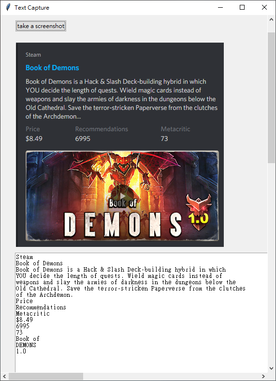

# TextCaptrue_FirstTrial
This is written in python with minial functionality. Users can choose a display (if multiple displays are available), take a screenshot --> select area --> cropped image is displayed inside the application and the text is captured by google vision API.

